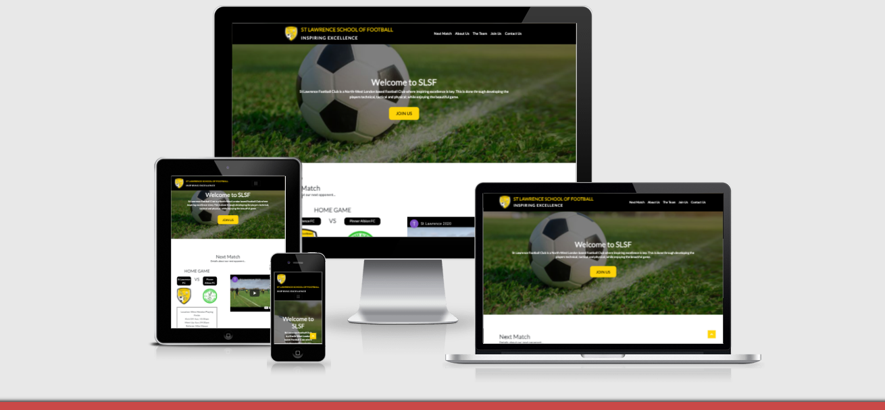

<a href="https://ibromurph.github.io/st-lawrence-fc/" title=":ink to St Lawrence Website">LINK TO PROJECT - ST LAWRENCE WEBSITE</a>

<h1>St Lawrence School of Football - Inspiring Excellence</h1>

St Lawrence School of Football is an amateur, youth, community football club based in North West London. They are a club that have helped and developed many young talented footballers players, some even going on to play professionally in the football leagues. As a community charity-funded football club, they're always on the lookout for local talent, both on and off the field. That means, to continue their good work, they require players, coaches or volunteers to be able to find them and join the club. They also require a location where existing players, parents and staff can go to find out details of upcoming matches and games.

<h2>User Experience</h2>

<h3>The audience</h3>
<ul>
<li>Existing players</li>
<li>Parents of players</li>
<li>Potential players</li>
<li>Parent of potential player</li>
<li>Volunteers</li>
<li>Existing coaches</li>
<li>Potential coaches</li>
</ul>

<h3>How does this website meet the needs of the intended audience?</h3>

The website allows the user to find out information and about the club. It serves both existing and new players, volunteers and coaches; it educatse on the ethos of the club, introduces them to the coaches, allows them to contact the club, and informs them of important upcoming matches/training.

<h3>User Stories</h3>
<ol>
<h4>Existing Players/Parents/Coaches:</h4>
<li>I want to be able to find out the location of the next match quickly. That means knowing the location, opponent, the kick-off time, the meet-up time and any match footage we might have on the team. </li>
<li>I want to see be able go know the details and location of upcoming training, especially when we change locations over the winter and summer months </li>
</ol>
<ol>
<h4>Existing Players/Parents/Coaches:</h4>
<li>I want to be able to find out details about the ethos of St Lawrence FC, as potentially I want to join.</li>
<li>I want to be able to find out details of training times and location</li>
<li>I want to be able to find out details of the coaching team and their credentials as I want the best type of coaching </li>
<li>I want to be able to contact the club if I have any queries</li>
</ol>
<ol>
<h4>Volunteers:</h4>
<li>I want to be able to find out details about the ethos of St Lawrence FC, as potentially I want to join and help out.</li>
<li>I want to be able to contact the club if I have any queries</li>
</ol>

<h3>Strategy</h3>

The aim of this website is to provide a simple to use, easy to navigate one-stop-shop for both existing and new potential players, parents, coaches and volunteers. The goal is to inform existing members of crucial weekly details such as training time and location, as well as match. The website also aims to encourage potential new players to sign up, by educating them on the incredible ethos of the club, as well as informing them on the qualified credentials of the coaches, who themselves aim to inspire excellence.

<h3>Scope</h3>

Users can scroll through the website and find the information that is relevant to them, in an easy, intuitive way. I aim to serve the user in both web and mobile format, as young people are more likely on their phones nowadays. The user can also contact the club should they require more information.

<h3>Structure</h3>
<ul>
<li>Home: The website will be a one page website split into dropdown sections. This was chosen to reduce the cognitive load on the users and make the site easy to navigate.</li>
<li>Next match section: Details about the upcoming fixture. Put at the top for the benefit of existing players/parents, as that's likely going to be the .</li>
<li>About us section: Informs potential parents, coaches, volunters and players about the club ethos</li>
<li>The team section: Details the coaching/management team and their role/credentials/qualifications</li>
<li>Join us section: Informs potential players of training locations and times</li>
<li>Contact us: If parents, volunteers or players have queries, they can reach out to the team here</li>
</ul>

<h2>Skeleton</h2>
<h3>Wireframes</h3>

I created wireframes using Balsqmiz for both web and mobile formation:  
<a href="assets/images/wireframes/Desktop UI.png">Web format</a> 
<a href="assets/images/wireframes/Mobile UI.png">Mobile format</a>

## Features

**Header**- There is a sticky navigation bar across all section of the main website so the user can easily navigate through the sections of the website

- The logo is also ever present and is a link back to the top of the page if the user needs to get back to it quickly

- When hovering over the navigation links they change to yellow and the text colour changes to black, letting the user know it is clickable

- The navigation bar collapses into a hamburger menu when viewed on smaller devices such as mobiles and ipads.

**Links** - All links in the header and footer that are hovered over change colour to notify the user of a link.

- All images have an alternative text to help screen readers, or information if the image link is broken.

**Buttons** - All buttons have the same style to help with consistency.

**Responsiveness** - All pages are responsive and have the same functionality on different devices

**Footer** - A footer navigation bar has been added at the bottom of the page so the user doesn't have to keep scrolling to the top to navigate the
site.

- Social links are grouped together so they can easily be located and the background changes colour when hovered over.

### Main Page Features

**Welcome to SLSF** - The main page has a hero section image with a call-to-action button that leads to the Join Us section of the page. The main purpose of this section is confirm to new users they've landed on the correct website and get new players to join the club!

**Next Match** - This section of the page has details of the next match. This is for existing players/parents who want fast information on the location/details of the next game. There is a link to googlemaps which will help direct parents to the location of the game that week. There's also a brief scouting video on the opponent, taken from the last time the club played them.

**About Us** - This About us section of the page has details of the club and its guiding principles. Using a card-grid system, with a teaser image, a title and some description card copy. 

An image carousel that is responsive and changes depending on the viewport. The allows the cakes to be viewed in better detail,
for example, in full screen width on a smartphone.

**Customer Favourites** - Card elements display the current top three best selling cakes and both the image and text are linked to the cake page
incase the user wants to order them.

**Shop** - The final section is an external link to a shop where the user can buy baking equipment (currently lakeland) along with a carousel of
images showing the user what equipment they may want to buy.

### Cake Page Features

If the user wants to see a specific cake in more detail, they can click on the 'Cake' link in the header or footer or on one of the images in the
gallery or customer favourites section. This leads to the Cake page, which has an individual images of the cakes, each in their own section
and a short description with a call-to-action button should the user which to order the cake.

### Order Form

Once the user click the 'Order Cake' button they will be led to the order form, which requires the fields to be completed before the form can be
submitted

### Future Features

- **Video Tutorials** - After initially planning to have a video tutorial section with an embedded video player on the home page, however,
  due to time restraints, this can be implemented at a later detailed

- **Active Navigation Link** - The users experience would be enhanced if the page they were on stayed highlighted in the navigation bar.

- **Quick Buy Option** - If the user knows what cake they would like to order, they can go straight to the order form, which would be more
  efficient than clicking through

- **Design a Cake** - A more flexible and interactive option where the user can input various cake flavours, buttercream and decoration to design
  their own unique cake

- **Testimonials** - Reviews from previous customers are a good way to get new users to trust a company.

- **Cake Categories** - As cakes are added to the website, a dropdown menu clearly categorising the cakes so the visitor can easily find what they
  are looking for may be required

<h2>Surface</h2>

In order to highlight Join as the main focus/goal, I'll put that on a banner at the top, although this can always change, according to whatever the main goal is for that month. It could aslo act as a news carousel.  

<b>Colour Scheme</b>  
The colour scheme will be St Lawrence specifice. It makes sense to go with the club's playing colours. That being yellowy-gold, black and white (from the logo). I used a colour picker to get the hex codes for these.

<b>Typograhy</b>  
The main font used is a sans-serif font 'Lato' with an alternative/backup as sans-serif, if it is not accessible. This font is clear, clean, modern and inspirational, which is in-keeping with the motto of St Lawrence FC.

<b>Imagery</b>  
Images on this website are responsive, and doesn't suffer from interference from the backgound.

<h1>Technologies Used</h1>
<b>Languages Used</b>
<ul><li>HTML5</li>
<li>CSS3</li>
<li>JavaScript</li>
</ul>

<b>Frameworks, Libraries & Programs Used</b>
<ol>
<li>Balsamiq: Used to create the wireframes</li>
<li>Google Fonts.</li>
<li>Bootstrap: Used for custom components such as navigation bar, grids, carousels and cards</li>
<li>Font Awesome: Used to add social icons</li>
<li>JQuery: Used in some components that can click and collapse such as nav bar a</li>
<li>>popper.js: Used in some components that can click and collapse such as nav bar </li>
<li>Git: Git was used for the ability to track changes and for version control</li>
<li>GitPod: GitPod, which is connected to GitHub, hosted the coding space and allowed the project to be committed to the GitHub repository</li>
<li>Github: Used to host the project files and publish the live website with Git Pages</li>
</ol>

<h1>Testing</h1>

<table>
  <tr>
    <th>Screen size</th>
    <th>Chrome </th>
    <th>Brave</th>
      <th>Firefox</th>
  </tr>
  <tr>
    <td>Mobile</td>
    <td>Tick</td>
    <td>Tick</td>
      <td>Not tested</td>
  </tr>
  <tr>
    <td>Desktop</td>
    <td>Tick</td>
    <td>Tick</td>
      <td>Tick</td>
  </tr>
  <tr>
    <td>Tablet</td>
    <td>Not tested</td>
    <td>Not tested</td>
      <td>Not tested</td>
  </tr>

</table>

I tested in 2  different browsers and across multiple breakpoints to ensure responsiveness. I also used googletools inspect and check it worked well across all devices on there.  
I checked and tested the Sign up form, the hover over states, the click through, the accessibility, the aria labels. I ensured that the form had the correct fields attributed to it (can't submit invalid email, etc).
 
I tested on: 
OS Compatibility - Windows 7 & 10, Android 10.0 and MacOS Big Sur v11.2.3. It has not as yet been tested on other Operating Systems.
  
Devices - The devices used in testing include an Oppo X2 Lite, Samsung 10, Asus x555l
  
Chrome DevTools - This website was thoroughly tests for responsiveness on Chrome DevTools. Viewport sizes from small (e.g. iPhone5), to large (Desktop 1200px and above) were simulated.

<h2>Bugs</h2>

Solved bugs: When I deployed the code to the Github pages, I did notice that the images were quite heavy, so I had to resize and compress them, and reupload them. I also noticed that the St Lawrence navigation title wasn't showing well on the very smallest mobile screen, so I had to resize it for better for that specific breakpoint.

<h2>Validator testing</h2>

W3C Markup Validator - Home Page - Pass - No errors present 
W3C CSS3 validator - Pass - No errors present 
Accessibilty - I can confirm the colours and fonts worked well and was easy to read by running through it in Lighthouse (in devtools). The only thing that may be an issue is the Perfrmance of the website due to the JS files loaded. <a href="assets/images/wireframes/lighthouse.png">Results shown here</a> 
<b>Unfixed bugs</b> 
All are largely related to performance issues. If I had more time, I'd more likely looks to reolsve those.

## Deployment

### Github Pages

This website was published using [GitHub Pages](https://pages.github.com/). The procedure is outlined below:

1. Go to [Github](https://github.com/) and log in.
2. Your repositories are listed on the left-hand side. Click on the repository that you want to open
   [Repository for this project.](https://github.com/ibromurph/st-lawrence-fc)
3. Underneath the repository name are some headings: Code, Issues, Pull requests, Actions, Projects, Wiki, Security, Insights and Settings.
   Click on Settings.
4. Scroll down until you see the heading 'GitHub Pages'
5. Under source is a dropdown menu, click on it and select 'master'.
6. The page will then reload and you will see the link of your published page displayed above the Source title.
7. It may take a few minutes for the background of the link to turn green, but once it does, your site is published and you will be able to open it.

### Forking The GitHub Repository

Forking the GitHub Repository makes a copy of the original repository so that you can view and/or make changes without affecting the original
repository. To do this:

1. Go to [Github](https://github.com/) and log in.
2. Locate a Repository (this is the one for this project - [Repository](https://github.com/ibromurph/st-lawrence-fc))
3. Above the "Settings" Button on the menu, on the right-hand side locate the "Fork" Button. It is next to the 'star' button.
4. You should now have a copy of the original repository in your GitHub account.

### Cloning

1. Go to [Github](https://github.com/) and log in.
2. Locate a Repository (this is the one for this project - [Repository](https://github.com/ibromurph/st-lawrence-fc))
3. Under the repository name, click the green "Clone or download" button.
4. To clone the repository using HTTPS, copy the link under "Clone with HTTPS".
5. Open a terminal and if you need to, change the current working directory to the location where you want the cloned directory to be made.
6. Type `git clone`, and then paste the URL you copied in Step 3 on GitHub.

`$ git clone https://github.com/YOUR-USERNAME/YOUR-REPOSITORY`

7. When you press Enter your local clone will be created.

<h2>Credits</h2>

<b>Code</b> 
Bootstrap library was used to for the navbar, image carousel, form, grids and card components. It was also used for the grid layout and responsive design. I also used the guidelines and sample structure from the Love Running project from the Code Institute.

### Media

- All images used were taken from [UnSplash](https://unsplash.com/) and [St Lawrence FC](https://slsf.co.uk/)

### Acknowledgements

- Thanks to St Lawrence SOF for their support/help in inspiring this project.
- Thanks to Charles Murphy for his guidance and advice throughout.
- Thanks my Mentor Chris Quinn for helping in ensuring I resubmit this coursework with the right sections included.

